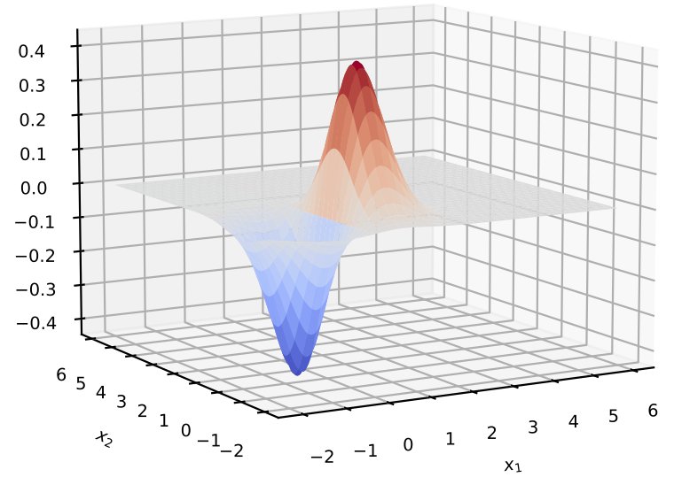
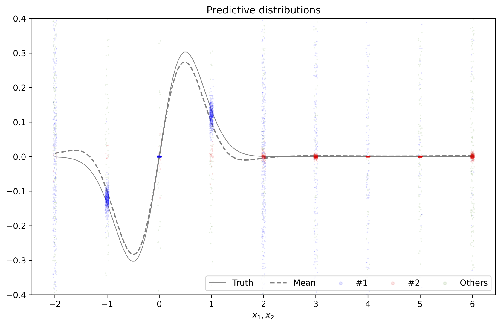

# Mixtures of Gaussian process experts based on kernel stick-breaking processes

by [Yuji Saikai](https://yujisaikai.com) and [Khue-Dung Dang](https://scholar.google.com.au/citations?user=lg56IkAAAAAJ&hl=en)

A preprint is (soon to be found) on arXiv. The code was tested under Python `3.11.1` and NumPy `1.24.1`. To run a batch of experiments, execute `experiments.py`. You may want to change some parameters (e.g. training samples, MCMC iterations, etc.) at the top of the script. Results are saved as `.pickle` files and stored in `experiments` directory. To process the results, execute `analysis.py`.

**Abstract** 
Mixtures of Gaussian process experts is a class of models that can simultaneously address two of the key limitations inherent in standard Gaussian processes: scalability and predictive performance. In particular, models that use Dirichlet processes as gating functions permit straightforward interpretation and automatic selection of the number of experts in a mixture. While the existing models are intuitive and capable of capturing non-stationarity, multi-modality and heteroskedasticity, the simplicity of their gating functions may limit the predictive performance when applied to complex data-generating processes. Capitalising on the recent advancement in the dependent Dirichlet processes literature, we propose a new mixture model of Gaussian process experts based on kernel stick-breaking processes. Our model maintains the intuitive appeal yet improve the performance of the existing models. To make it practical, we design a sampler for posterior computation based on the slice sampling. The model behaviour and improved predictive performance are demonstrated in experiments using six datasets.

&nbsp;

&nbsp;

